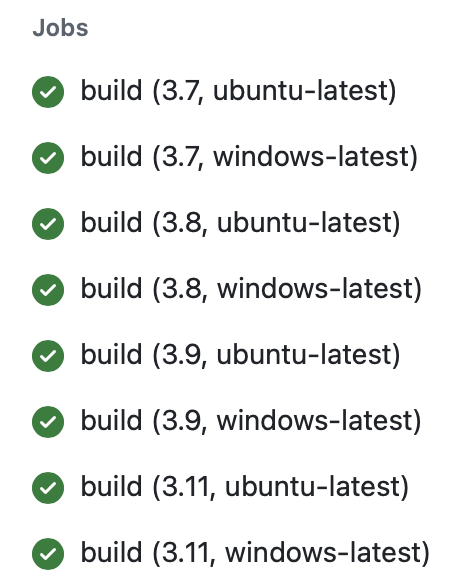

# Leo Chen Mini 4: GitHub Actions Matrix Build for Multiple Python Versions

## Project Objective

The goal of this project is to test various Python versions and environments using GitHub Actions. I utilized the `setup-python` action along with the `matrix strategy` to run multiple jobs with different configurations.

This repo includes a `main.py` file with a function named `square_number(x)`. This function takes a number as input and returns its square. The functionality of this function is verified through tests in the `test_main.py` file.

Repository Contents:

* `main.py`

* `test_main.py`

* `.devcontainer`

* `ci.yml`

* `Makefile`

* `requirements.txt`

* `README.md`

## Result

Navigate to the *Actions* page or click on the *CI badge* to view results.

